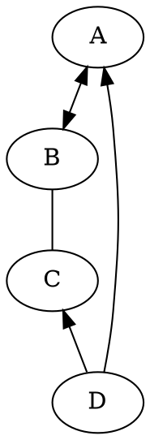

# **🧡**

------

# **写在最前**

------

<table><tr><td bgcolor=PowderBlue>输入内容</td></tr></table>

**好了，开始阅读吧！**

------

**DOT 语言作图**

| Type    | Heading   |
| ------- | --------- |
| NOTE    | Note      |
| TIP     | Tip       |
| WARNING | Warning   |
| DANGER  | Attention |

> [!NOTE]
> An alert of type 'note' using global style 'callout'.

