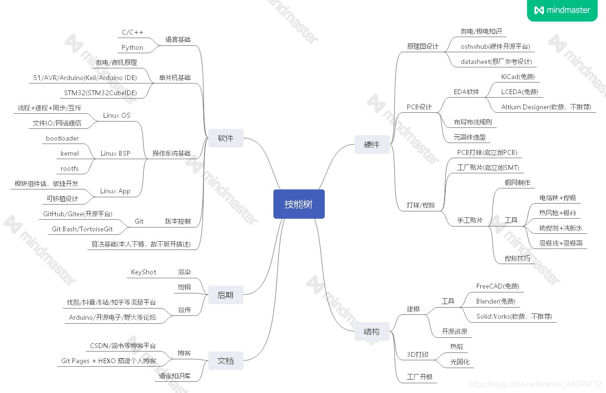

    

  
  
  </a>

---
# **来啦**！🎉🎉🎉

**谈到我为什么会用`"野生钢铁侠の知识库"`来命名这个文档网站，或许您点击一下上方那张出自《请回答1988》的剧照，就能找到答案。**

**回来了吧！浏览完`稚晖君`的Bilibili主页，是不是有种`"我看不懂，但大为震撼"`的感觉。对，我第一次感到大为震撼，是通过下面这个视频。**

<iframe src="//player.bilibili.com/player.html?aid=96244032&bvid=BV1jE41137eu&cid=164144278&page=1" scrolling="no" border="0" frameborder="no" framespacing="0" allowfullscreen="true"> </iframe>

**在这个视频下方，我留意到这样一条评论：**

> "电子基础，电子元器件选型，电路原理图设计，高速电路PCB设计，电子元器件焊接技术，电路板调试，启动程序UBOOT裁剪移植，linux内核裁剪移植，文件系统，低层驱动程序(C语言,ARM架构汇编，linux内核架构)，上层应用程序(C++,Qt,JAVA,Python等，深度学习，机器学习，Opencv，神经网络，自然语言处理)，静态博客服务器搭建，高等数学，线性代数，概率论，离散数学，3D建模，3D打印，雕刻机，视频拍摄后期制作......"

**一个项目，涉及如此之广的技术，而它，仅由一个人完成。稚晖君配得上这样的赞誉：`一个人，就是一只队伍！`**

> **稚晖君，华为昇腾计算DSA和AI算法工程师，B站百万粉视频博主。**
>
> **他，就是野生钢铁侠!**
>
> **他，就是我的偶像！**

------

**在一次稚晖君的采访当中，有一句话我印象很是深刻，`"任何先进的科技对普通人来说像魔法一样，我觉得很酷。"`的确，我第一次看到他的作品的时候，也感觉那像是魔法一样：小小的一个装置，竟可以实现如此复杂的功能，这太酷了!想想自己的专业:`电子信息工程`，哎!咱就是干这个的呀!这也是我第一次对自己的专业有了明确的认识。同时也立志成为像稚晖君一样酷酷的人。**

**如何也能成为野生钢铁侠，我一直在思考。直到偶然间看到了这两个视频：**

> **软件篇：**

<iframe src="//player.bilibili.com/player.html?aid=91299923&bvid=BV1F7411u71s&cid=155884314&page=1" scrolling="no" border="0" frameborder="no" framespacing="0" allowfullscreen="true"> </iframe>

> **硬件篇：**

<iframe src="//player.bilibili.com/player.html?aid=73533882&bvid=BV19E411a7Sf&cid=125772471&page=1" scrolling="no" border="0" frameborder="no" framespacing="0" allowfullscreen="true"> </iframe>

**于是便获得了这株可以让我们成为野生钢铁侠的`技能树`。**

**这也正是这个网站的核心架构。**

------

***我想制作这样一个知识库网站：在这里，我会为每一个跟我一样，想成为野生钢铁侠，但不知从何下手的的大学生，提供技能树中每一项技能的详细学习的路线。如果这个网站能够给一些志同道合的人一点的帮助，就一切都值得了。***

---

🚩**好啦！点击左侧的导航栏开启你的探索之旅吧！**

